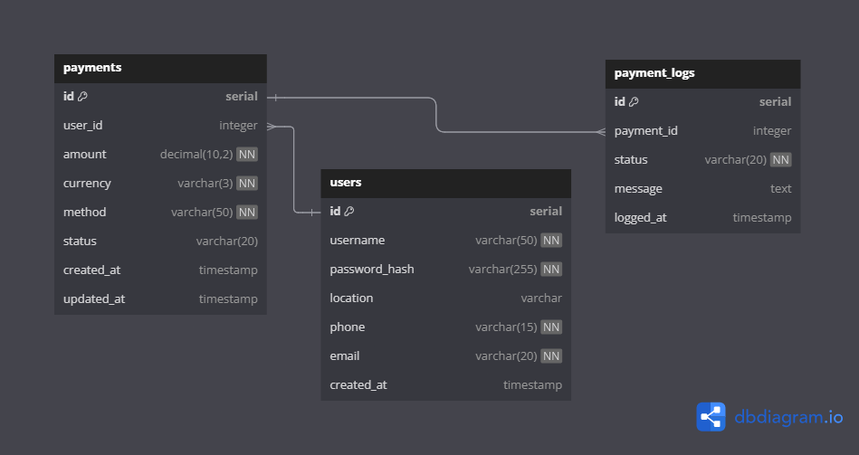

# Payment Polling Service

This project implements a payment polling service integrating with Payd APIs for handling card and mobile payments. The system is built using a microservices architecture with Golang, PostgreSQL, AMQP, and RPC protocols.

## Database Schema


## Getting Started

### Prerequisites

- [Gitpod](https://gitpod.io/)
- PostgreSQL
- Golang
- Payd API credentials

### Open in Gitpod

You can quickly start working on this project by opening it in Gitpod:

[](https://gitpod.io/#https://github.com/tufstraka/pps)

### Local Setup

#### Step 1: Set Up PostgreSQL

Ensure you have PostgreSQL installed and running on your local machine. Set up a username and password for accessing PostgreSQL.

#### Step 2: Migrate the Database

Run the following command to migrate the database. Ensure all the necessary environment variables (`PGUSER`, `PGPASSWORD`, `PGHOST`, `PGPORT`, `PGDATABASE`, and `PGSSLMODE`) are defined based on your setup:

```sh
migrate -path=db/migrations -database "postgres://$PGUSER:$PGPASSWORD@$PGHOST:$PGPORT/$PGDATABASE?sslmode=$PGSSLMODE" -verbose up
```

### Step 3: Create a .env File

Create a .env file at the root of the project with the following credentials:

```sh
DATABASE_URL=postgres://<username>:<password>@<host>:<port>/<database>?sslmode=disable
PAYD_USERNAME=<your_payd_username>
PAYD_PASSWORD=<your_payd_password>
```
Replace <username>, <password>, <host>, <port>, <database>, <your_payd_username>, and <your_payd_password> with your actual database and Payd API credentials. You can get the Payd username and password from your Payd dashboard.

## Running the Services


